# 接口页面

## 总览

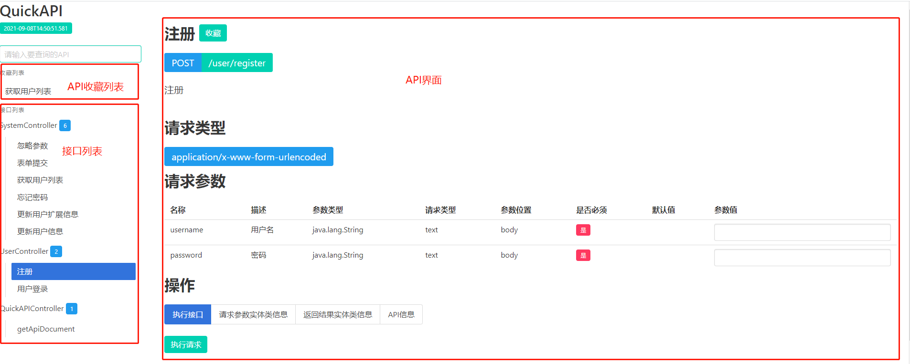

入口页面分成API收藏列表,API列表以及API界面.

## API搜索

QuickAPI支持API搜索功能,在搜索框内输入关键字,系统会根据api的描述信息和api请求地址自动过滤出符合条件的API接口.

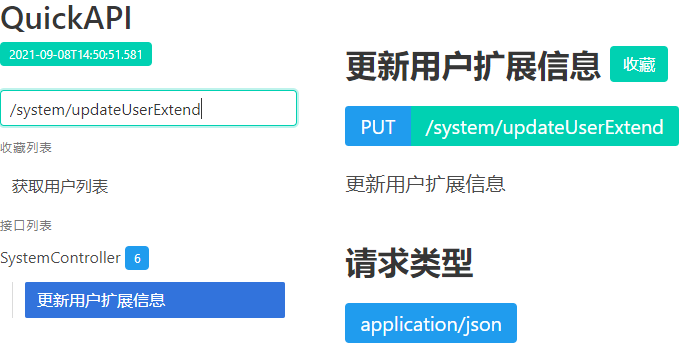

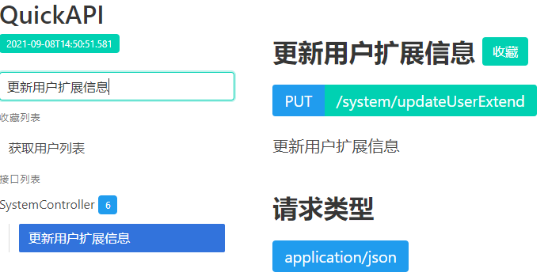

## 请求实体类信息和返回实体类

QuickAPI会展示请求参数和返回结果与之关联的实体类信息

> 默认情况下不会生成任何实体类信息,若要展示实体类信息请设置实体类配置信息.请参阅[进阶配置](./option.md)

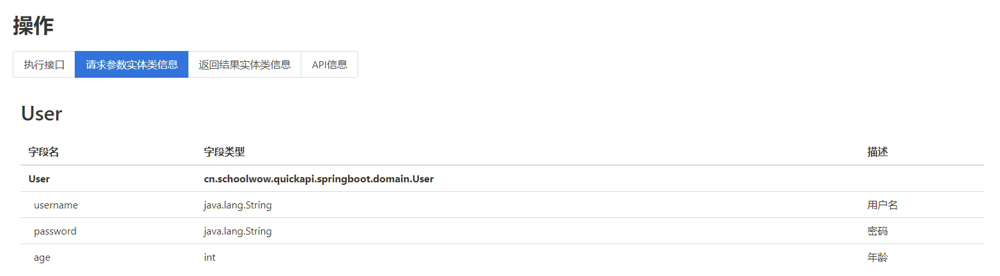

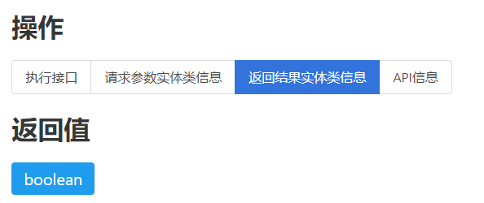

## 请求参数方案

QuickAPI支持保存多种请求参数.默认情况下,当执行请求时,当前请求参数会存储在名为默认参数的方案内.您可以重新设置请求参数值,然后保存为新的请求参数方案.

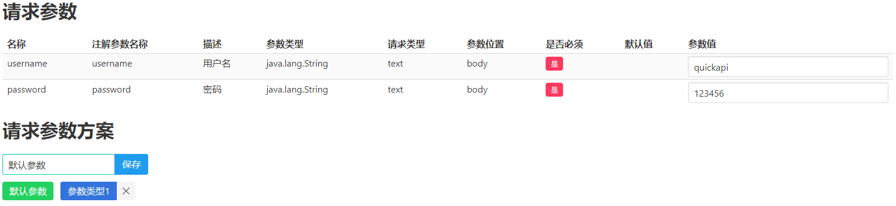

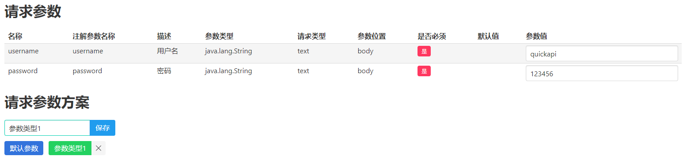

## 收藏功能

QuickAPI支持收藏功能,您可以收藏常用的API接口.界面左上方会显示您的收藏API列表.

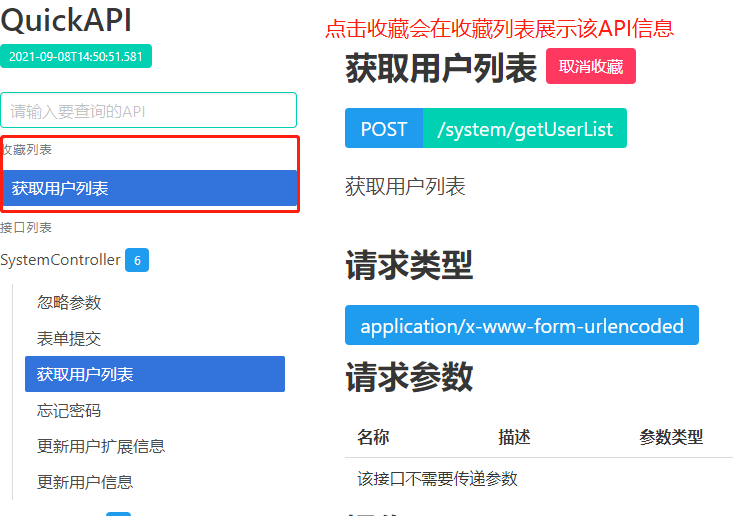

## 执行请求

在api界面点击执行请求,系统会发送ajax请求到后台.

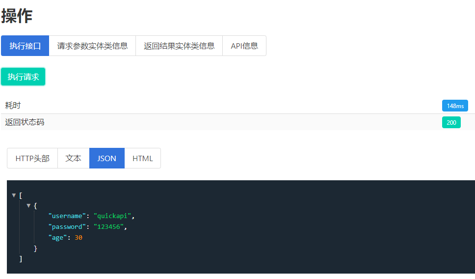

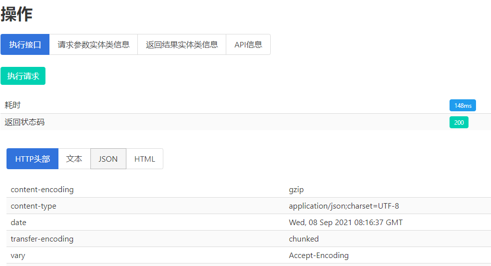

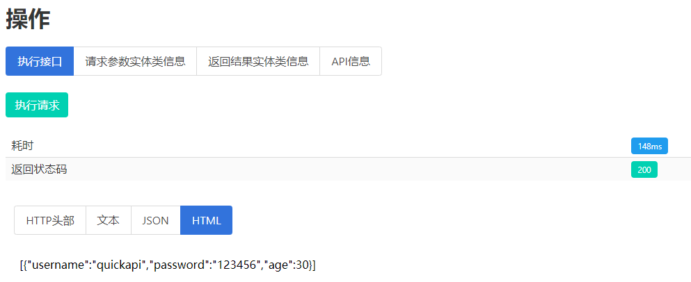

## 刷新时执行

某些请求(例如登录操作)在后台重启后需要重新操作.QuickAPI执行设定刷新时执行,开启该功能后,刷新页面时该接口会自动请求.

> 请注意刷新时执行所用请求参数方案为默认参数.

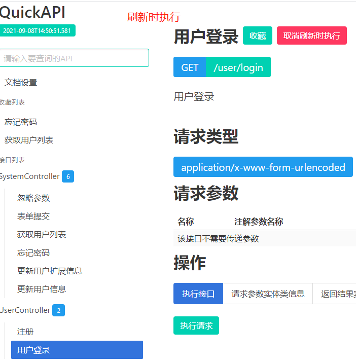

## 全局头部

QuickAPI支持全局头部,设置完成后在所有ajax请求都会加上这些头部信息.

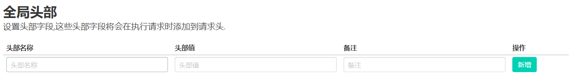